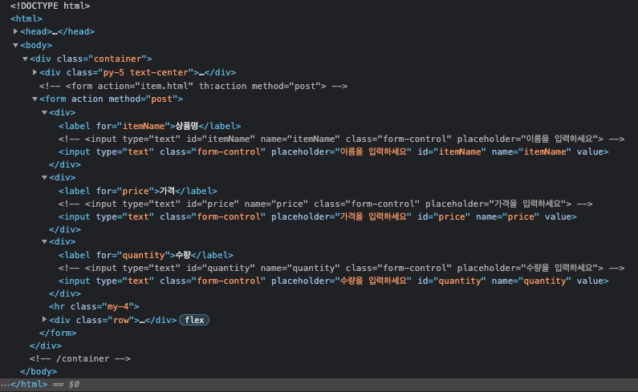

# 타임리프 - 스프링 통합과 폼
## 프로젝트 설정
[MVC 1편 - 7강](https://github.com/MinyShrimp/Spring-Core-MVC-Seven)에서 했던 프로젝트를 바탕으로 진행된다. 

## 타임리프 스프링 통합
* [기본 메뉴얼](https://www.thymeleaf.org/doc/tutorials/3.0/usingthymeleaf.html)
* [스프링 통합 메뉴얼](https://www.thymeleaf.org/doc/tutorials/3.0/thymeleafspring.html)

타임리프는 스프링 없이도 동작하지만, 스프링과 통합을 위한 다양한 기능을 제공한다.

### 스프링 통합으로 추가되는 기능들
* 스프링의 SpringEL 문법 통합
* `${@myBean.doSomething()}`처럼 스프링 빈 호출 지원
* 편리한 폼 관리를 위한 추가 속성
  * `th:object`: 기능 강화, 폼 커맨드 객체 선택
  * `th:field`, `th:errors`, `th:errorclass`
* 폼 컴포넌트 기능
  * checkbox, radio button, List 등을 편리하게 사용할 수 있는 기능 지원
* 스프링의 메시지, 국제화 기능의 편리한 통합
* 스프링의 검증, 오류 처리 통합
* 스프링의 변환 서비스 통합

### 타임리프 관련 설정 변경
* `application.properties`
* [링크](https://docs.spring.io/spring-boot/docs/current/reference/html/application-properties.html#appendix.application-properties.templating)

## 입력 폼 처리
지금부터 타임리프가 제공하는 입력 폼 기능을 적용해서 기존 프로젝트의 폼 코드를 타임리프가 지원하는 기능을 사용해서 효율적으로 개선해보자.

### FormItemController
```java
@Controller
@RequestMapping("/form/items")
@RequiredArgsConstructor
public class FormItemController {
  @GetMapping("/add")
  public String addForm(Model model) {
    model.addAttribute("item", new Item());
    return "form/addForm";
  }
}
```

### addForm.html
```html
<!-- <form action="item.html" th:action method="post"> -->
<form action="item.html" th:action th:object="${item}" method="post">
    <div>
        <label for="itemName">상품명</label>
        <!-- <input type="text" id="itemName" name="itemName" class="form-control" placeholder="이름을 입력하세요"> -->
        <input type="text" th:field="*{itemName}" class="form-control" placeholder="이름을 입력하세요">
    </div>
    <div>
        <label for="price">가격</label>
        <!-- <input type="text" id="price" name="price" class="form-control" placeholder="가격을 입력하세요"> -->
        <input type="text" th:field="*{price}" class="form-control" placeholder="가격을 입력하세요">
    </div>
    <div>
        <label for="quantity">수량</label>
        <!-- <input type="text" id="quantity" name="quantity" class="form-control" placeholder="수량을 입력하세요"> -->
        <input type="text" th:field="*{quantity}" class="form-control" placeholder="수량을 입력하세요">
    </div>
</form>
```

### 결과

* `<form th:object="${item}>`
  * `<form>`에서 사용할 객체를 지정한다.
  * 하위 태그에서 `*{...}` 형식으로 지정할 수 있다.
* `th:field="*{itemName}"`
  * `*{itemName}`는 선택 변수 식을 사용했는데, `${item.itemName}`과 같다.
  * `th:field`는 `id`, `name`, `value` 속성을 자동으로 만들어준다.
    * `id`, `name`: `th:field`에서 지정한 변수 이름과 같도록 설정해준다.
    * `value`: 컨트롤러에서 넘어온 값이 있다면 여기에 넣어준다. (초기값)

## 수정 폼 처리
### FromItemController
```java
@Controller
@RequestMapping("/form/items")
@RequiredArgsConstructor
public class FormItemController {
  @GetMapping("/{itemId}/edit")
  public String editForm(
          @PathVariable long itemId,
          Model model
  ) {
    Item item = itemRepository.findById(itemId);
    model.addAttribute("item", item);
    return "form/editForm";
  }
}
```

### editForm.html
```html
<!-- <form action="item.html" th:action method="post"> -->
<form action="item.html" th:action th:object="${item}" method="post">
    <div>
        <label for="id">상품 ID</label>
        <!-- <input type="text" id="id" name="id" class="form-control" value="1" th:value="${item.id}" readonly> -->
        <input type="text" th:field="*{id}" class="form-control" readonly>
    </div>
    <div>
        <label for="itemName">상품명</label>
        <!-- <input type="text" id="itemName" name="itemName" class="form-control" value="상품A" th:value="${item.itemName}"> -->
        <input type="text" th:field="*{itemName}" class="form-control">
    </div>
    <div>
        <label for="price">가격</label>
        <!-- <input type="text" id="price" name="price" class="form-control" value="10000" th:value="${item.price}"> -->
        <input type="text" th:field="*{price}" class="form-control">
    </div>
    <div>
        <label for="quantity">수량</label>
        <!-- <input type="text" id="quantity" name="quantity" class="form-control" value="10" th:value="${item.quantity}"> -->
        <input type="text" th:field="*{quantity}" class="form-control">
    </div>
</form>
```

### 결과


## 요구사항 추가
타임리프를 사용해서 폼에서 체크박스, 라디오 버튼, 셀렉트 박스를 편리하게 사용하는 방법을 학습해보자.
기존 상품 서비스에 다음 요구사항이 추가되었다.

* 판매 여부
  * 판매 오픈 여부
  * 체크 박스로 선택할 수 있다.
* 등록 지역
  * 서울, 부산, 제주
  * 체크 박스로 다중 선택할 수 있다.
* 상품 종류
  * 도서, 식품, 기타
  * 라디오 버튼으로 하나만 선택할 수 있다.
* 배송 방식
  * 빠른 배송
  * 일반 배송
  * 느린 배송
  * 셀렉트 박스로 하나만 선택할 수 있다.

### ItemType - 상품 종류
```java
public enum ItemType {
    BOOK("도서"), FOOD("음식"), ETC("기타");

    private final String description;

    ItemType(String description) {
        this.description = description;
    }

    public String getDescription() {
        return description;
    }
}
```
상품 종류는 ENUM 을 사용한다. 설명을 위해 description 필드를 추가했다.

### DeliveryCode - 배송 방식
```java
@Getter @Setter
@AllArgsConstructor
public class DeliveryCode {
    private String code;
    private String displayName;
}
```
배송 방식은 DeliveryCode 클래스를 사용한다. 
`code`는 `FAST`같이 시스템에서 전달하는 값이고, 
`displayName`은 `빠른 배송`같이 고객에게 보여주는 값이다.

### Item - 상품
```java
@Getter @Setter @ToString
public class Item {
    private Long id;
    private String itemName;
    private Integer price;
    private Integer quantity;

    private Boolean open;           // 판매 여부
    private List<String> regions;   // 등록 지역
    private ItemType itemType;      // 상품 종류
    private String deliveryCode;    // 배송 방식

    public Item() {}

    public Item(String itemName, Integer price, Integer quantity) {
        this.itemName = itemName;
        this.price = price;
        this.quantity = quantity;
    }
}
```

ENUM, 클래스, String 같은 다양한 상황을 준비했다.
각각의 상황에 어떻게 폼의 데이터를 받을 수 있는지 하나씩 알아보자.

## 체크 박스 - 단일 1
### addForm.html
```html
<hr class="my-4">
<!-- Single Checkbox -->
<div>판매 여부</div>
<div>
    <div class="form-check">
        <input type="checkbox" id="open" name="open" class="form-check-input">
        <label for="open" class="form-check-label">판매 오픈</label>
    </div>
</div>
```

### FormItemController
```java
@Slf4j
@Controller
@RequestMapping("/form/items")
@RequiredArgsConstructor
public class FormItemController {
  @PostMapping("/add")
  public String addItem(
          @ModelAttribute Item item,
          RedirectAttributes redirectAttributes
  ) {
    log.info("item={}", item);
    log.info("item.open={}", item.getOpen());

    Item savedItem = itemRepository.save(item);
    redirectAttributes.addAttribute("itemId", savedItem.getId());
    redirectAttributes.addAttribute("status", true);
    return "redirect:/form/items/{itemId}";
  }
}
```

### 실행 로그
```
// 체크 박스를 선택하는 경우
item=Item(id=null, itemName=testC, price=20500, quantity=102, open=true, regions=null, itemType=null, deliveryCode=null)
item.open=true 

// 체크 박스를 해제하는 경우
item=Item(id=null, itemName=adsf, price=20500, quantity=42, open=null, regions=null, itemType=null, deliveryCode=null)
item.open=null 
```
헉! 체크 박스를 선택하지 않으면, `open` 필드 자체가 서버로 전송되지 않는다!

HTML checkbox는 선택이 안되면 클라이언트에서 서버로 값 자체를 보내지 않는다. 
수정의 경우에는 상황에 따라서 이 방식이 문제가 될 수 있다. (NPE)
사용자가 의도적으로 체크되어 있던 값을 체크를 해제해도 저장시 아무 값도 넘어가지 않기 때문에, 
서버 구현에 따라서 값이 오지 않은 것으로 판단해서 값을 변경하지 않을 수도 있다.

`if( item.getOpen() != null ) {}` 등과 같이 해결할 수도 있겠지만, 코드가 더러워지는 불행한 미래가 기다릴뿐이다. 

### 해결 방법 1
```html
<hr class="my-4">
<!-- Single Checkbox -->
<div>판매 여부</div>
<div>
    <div class="form-check">
        <input type="checkbox" id="open" name="open" class="form-check-input">
        <!-- 히든 필드 추가 -->
        <input type="hidden" name="_open" value="on">
        <label for="open" class="form-check-label">판매 오픈</label>
    </div>
</div>
```
```
// 체크 박스를 선택하는 경우
item=Item(id=null, itemName=testC, price=20500, quantity=42, open=true, regions=null, itemType=null, deliveryCode=null)
item.open=true

// 체크 박스를 해제하는 경우
item=Item(id=null, itemName=adsf, price=100, quantity=102, open=false, regions=null, itemType=null, deliveryCode=null)
item.open=false
```

이런 문제를 해결하기 위해서 스프링 MVC는 약간의 트릭을 사용하는데, 
히든 필드를 하나 만들어서, `_open` 처럼 기존 체크 박스 이름 앞에 언더스코어( _ )를 붙여서 전송하면 체크를 해제했다고 인식할 수 있다. 
히든 필드는 항상 전송된다. 
따라서 체크를 해제한 경우 여기에서 open 은 전송되지 않고, _open 만 전송되는데, 이 경우 스프링 MVC는 체크를 해제했다고 판단한다.

## 체크 박스 - 단일 2
개발할 때 마다 이렇게 히든 필드를 추가하는 것은 상당히 번거롭다.
타임리프가 제공하는 폼 기능을 사용하면 이런 부분을 자동으로 처리할 수 있다.

### 타임리프 - 체크 박스 코드 추가
```html
<hr class="my-4">
<!-- Single Checkbox -->
<div>판매 여부</div>
<div>
    <div class="form-check">
        <!-- 
        <input type="checkbox" id="open" name="open" class="form-check-input">
        히든 필드 추가
        <input type="hidden" name="_open" value="on"> 
        -->
        <input type="checkbox" th:field="*{open}" class="form-check-input">
        <label for="open" class="form-check-label">판매 오픈</label>
    </div>
</div>
```

### 결과


* `<input type="hidden" name="_open" value="on"/>` 
* `th:field`를 사용하면 타임리프에서 히든 필드를 자동으로 생성해준다 !

### 상품 상세 - item.html
```html
<hr class="my-4">
<!-- Single Checkbox -->
<div> 판매 여부 </div>
<div>
    <div class="form-check">
        <input type="checkbox" th:field="${item.open}" disabled>
        <label for="open" class="form-check-label">판매 오픈</label>
    </div>
</div>
```

### 상품 상세 결과


### 상품 수정 - editForm.html
```html
<hr class="my-4">
<!-- Single Checkbox -->
<div>판매 여부</div>
<div>
    <div class="form-check">
        <input type="checkbox" th:field="*{open}" class="form-check-input">
        <label for="open" class="form-check-label"> 판매 오픈 </label>
    </div>
</div>
```

### 상품 수정 - ItemRepository.update
```java
@Repository
public class ItemRepository {
    public void update(Long itemId, Item updateParam) {
        Item findItem = findById(itemId);
        findItem.setItemName(updateParam.getItemName());
        findItem.setPrice(updateParam.getPrice());
        findItem.setQuantity(updateParam.getQuantity());
        
        // 추가
        findItem.setOpen(updateParam.getOpen());
        findItem.setRegions(updateParam.getRegions());
        findItem.setItemType(updateParam.getItemType());
        findItem.setItemName(updateParam.getItemName());
        findItem.setDeliveryCode(updateParam.getDeliveryCode());
    }
}
```

### 상품 수정 결과


## 체크 박스 - 멀티
체크 박스를 멀티로 사용해서, 하나 이상을 체크할 수 있도록 해보자.

* 등록 지역: 서울, 부산, 제주

### FormItemController
```java
@Slf4j
@Controller
@RequestMapping("/form/items")
@RequiredArgsConstructor
public class FormItemController {
  @ModelAttribute("regions")
  public Map<String, String> regions() {
    Map<String, String> regions = new LinkedHashMap<>();
    regions.put("SEOUL", "서울");
    regions.put("BUSAN", "부산");
    regions.put("JEJU", "제주");
    return regions;
  }
}
```

### ModelAttribute 의 특별한 사용법
등록 폼, 상세화면, 수정 폼에서 모두 서울, 부산, 제주라는 체크 박스를 반복해서 보여주어야 한다.
이렇게 하려면 각각의 컨트롤러에서 `model.addAttribute()`를 사용해서 체크 박스를 구성하는 데이터를 반복해서 넣어주어야한다.
`@ModelAttribute`는 이렇게 컨트롤러에 있는 별도의 메서드에 적용할 수 있다.
이렇게하면, 해당 컨트롤러를 요청할 때, `regions`에서 반환한 값이 자동으로 모델(`model`)에 담기게 된다.
물론 이렇게 사용하지 않고, 각각의 컨트롤러 메서드에서 모델에 직접 데이터를 담아서 처리해도 된다.

### addForm.html
```html
<!-- Multi Checkbox -->
<div>등록 지역</div>
<div th:each="region : ${regions}" class="form-check form-check-inline">
    <input type="checkbox" th:field="*{regions}" th:value="${region.key}" class="form-check-input">
    <label th:for="${#ids.prev('regions')}" th:text="${region.value}" class="form-check-label"></label>
</div>
```

#### `th:field="*{regions}"`
`*{regions}`는 `model`에 넘어온 `regions`가 아닌, `item.regions`이다.
이때, `th:each`에 의해 반복되고 있는 중에 id, name을 넣어야하는데, name은 같아도 되지만, id는 모두 달라야 한다. 
타임리프는 `regions`라는 이름을 이용해 이를 자동으로 넣어준다.

* id: 변수명 + 1, 2, 3..
* name: 변수명

#### `th:for="${#ids.prev('regions')}"`
반복되고 있는 `regions`( model에서 넘어온 )에서 `ids.prev`, `ids.next`를 이용해 동적으로 생성되는 id 값을 가져올 수 있게 지원한다.

### 실행 결과


### 로그 출력
```
item = Item(
  id=null, itemName=testC, price=20500, quantity=42, 
  open=true, regions=[SEOUL, JEJU], itemType=null, deliveryCode=null
)
```

### 상세페이지 - item.html
```html
<!-- Multi Checkbox -->
<div>
    <div>등록 지역</div>
    <div th:each="region : ${regions}" class="form-check form-check-inline">
        <input type="checkbox" th:field="${item.regions}" th:value="${region.key}" class="form-check-input" disabled>
        <label th:for="${#ids.prev('regions')}" th:text="${region.value}" class="form-check-label"></label>
    </div>
</div>
```

### 상세페이지 결과


### 타임리프의 체크 확인
타임리프는 `th:field`에 지정한 값과 `th:value`의 값을 비교해서 체크를 자동으로 처리해준다.

### 수정페이지 - editForm.html
```html
<!-- Multi Checkbox -->
<div>
    <div>등록 지역</div>
    <div th:each="region : ${regions}" class="form-check form-check-inline">
        <input type="checkbox" th:field="${item.regions}" th:value="${region.key}" class="form-check-input">
        <label th:for="${#ids.prev('regions')}" th:text="${region.value}" class="form-check-label"></label>
    </div>
</div>
```

### 수정페이지 결과


## 라디오 버튼
라디오 버튼은 여러 선택지 중에 하나를 선택할 때 사용할 수 있다.
이번시간에는 라디오 버튼을 자바 ENUM을 활용해서 개발해보자.

### FormItemController
```java
@Slf4j
@Controller
@RequestMapping("/form/items")
@RequiredArgsConstructor
public class FormItemController {
  @ModelAttribute("itemTypes")
  public ItemType[] itemTypes() {
    return ItemType.values();
  }
}
```

### addForm.html
```html
<!-- Radio Button -->
<div>
    <div>상품 종류</div>
    <div th:each="type : ${itemTypes}" class="form-check form-check-inline">
        <input type="radio" th:field="*{itemType}" th:value="${type.name()}" class="form-check-input">
        <label th:for="${#ids.prev('itemType')}" th:text="${type.description}" class="form-check-label"></label>
    </div>
</div>
```

### 결과


### 실행 로그
```
// 값이 없을 때
item.itemType = null

// 값이 있을 때
item.itemType = FOOD
```

### 상세페이지 - item.html
```html
<!-- Radio Button -->
<div>
    <div>상품 종류</div>
    <div th:each="type : ${itemTypes}" class="form-check form-check-inline">
        <input type="radio" th:field="${item.itemType}" th:value="${type.name()}" class="form-check-input" disabled>
        <label th:for="${#ids.prev('itemType')}" th:text="${type.description}" class="form-check-label"></label>
    </div>
</div>
```

### 상세페이지 결과


### 수정페이지 - editForm.html
```html
<!-- Radio Button -->
<div>
    <div>상품 종류</div>
    <div th:each="type : ${itemTypes}" class="form-check form-check-inline">
        <input type="radio" th:field="*{itemType}" th:value="${type.name()}" class="form-check-input">
        <label for="${#ids.prev('itemType')}" th:text="${type.description}" class="form-check-label"></label>
    </div>
</div>
```

### 수정페이지 결과


### 타임리프에서 ENUM 직접 접근
```html
<div th:each="type : ${T(hello.springcoremvc22.domain.item.ItemType).values()}">
```
자바의 ENUM의 풀 패키지를 입력하면 스프링 EL을 이용해으로 ENUM을 직접 접근하여 사용할 수 있다.

그런데, 이렇게 사용하면 ENUM의 패키지 위치가 변경되버리면 저 부분에서 인식이 안되며, 저렇게 작성한 모든 코드를 수정해줘야 한다.
그런데 더 큰 문제는 이를 컴파일 단계에서 알아차릴 수 없고, 오직 런타임에서 발견할 수 있기 때문에 권장되는 방법이 아니다.

## 셀렉트 박스
셀렉트 박스는 여러 선택지 중에 하나를 선택할 수 있다.
이번 시간에는 셀렉트 박스를 자바 객체를 활용해서 개발해보자.

### FormItemController
```java
@Slf4j
@Controller
@RequestMapping("/form/items")
@RequiredArgsConstructor
public class FormItemController {
  @ModelAttribute("deliveryCodes")
  public List<DeliveryCode> deliveryCodes() {
    List<DeliveryCode> deliveryCodes = new ArrayList<>();
    deliveryCodes.add(new DeliveryCode("FAST", "빠른 배송"));
    deliveryCodes.add(new DeliveryCode("NORMAL", "보통 배송"));
    deliveryCodes.add(new DeliveryCode("SLOW", "느린 배송"));
    return deliveryCodes;
  }
}
```

### 추가페이지 - addForm.html
```html
<!-- Select Box -->
<div>
    <div>배송 방식</div>
    <select th:field="*{deliveryCode}" class="form-select">
        <option value="">== 배송 방식 선택 ==</option>
        <option 
            th:each="deliveryCode : ${deliveryCodes}" 
            th:value="${deliveryCode.code}" 
            th:text="${deliveryCode.displayName}"
        ></option>
    </select>
</div>
```

### 추가페이지 결과


### 상세페이지 - item.html
```html
<!-- Select Box -->
<div>
    <div>배송 방식</div>
    <select th:field="${item.deliveryCode}" class="form-select" disabled>
        <option value="">== 배송 방식 선택 ==</option>
        <option 
            th:each="deliveryCode : ${deliveryCodes}" 
            th:value="${deliveryCode.code}" 
            th:text="${deliveryCode.displayName}"
        ></option>
    </select>
</div>
```

### 상세페이지 결과


### 수정페이지 - editForm.html
```html
<!-- Select Box -->
<div>
    <div>배송 방식</div>
    <select th:field="*{deliveryCode}" class="form-select">
        <option value="">== 배송 방식 선택 ==</option>
        <option 
            th:each="deliveryCode : ${deliveryCodes}" 
            th:value="${deliveryCode.code}" 
            th:text="${deliveryCode.displayName}"
        ></option>
    </select>
</div>
```

### 수정페이지 결과

