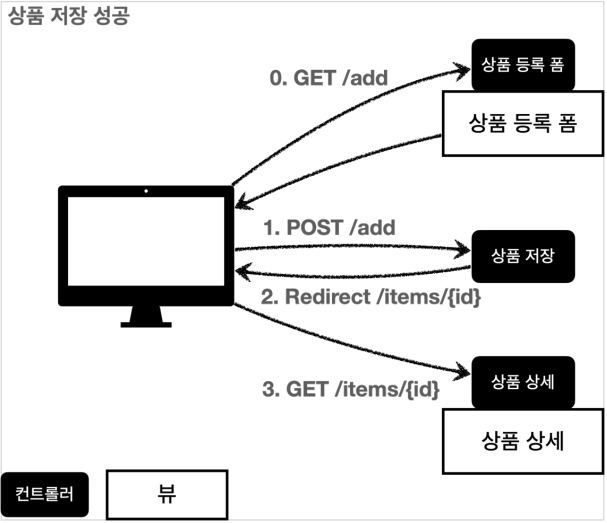
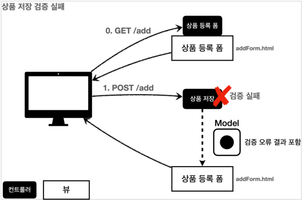
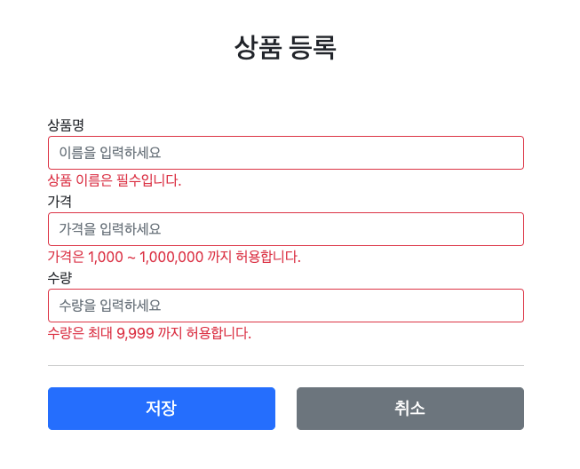
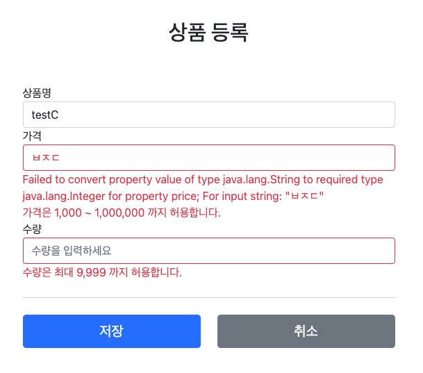
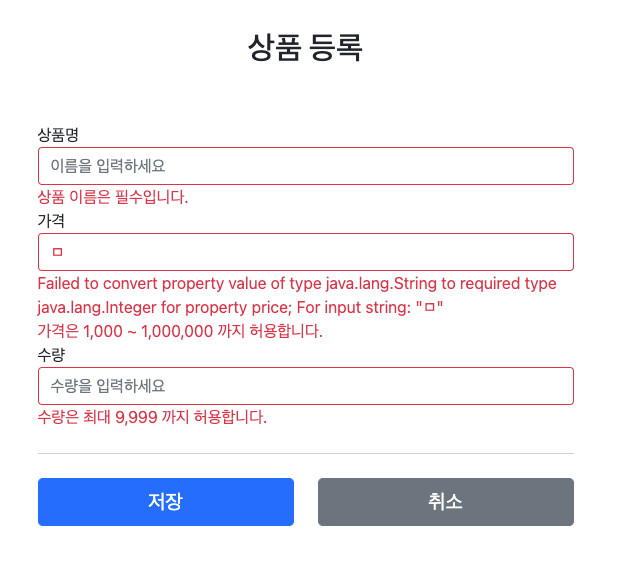
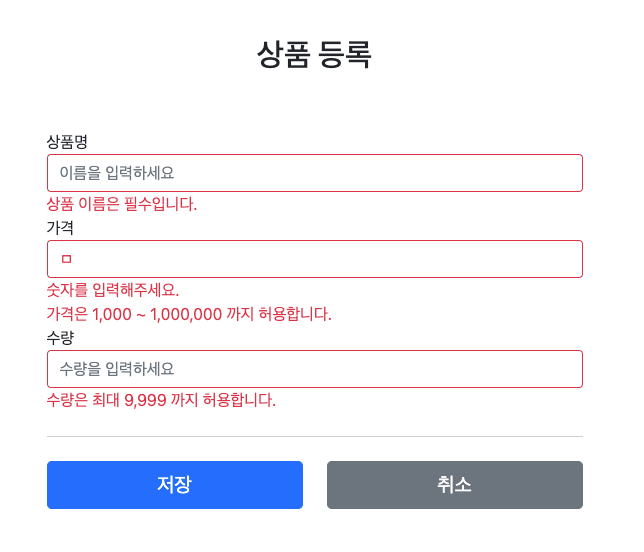

# 검증 1 - Validation

## 검증 요구사항

### 요구사항: 검증 로직 추가

* 타입 검증
    * 가격, 수량에 문자가 들어가면 검증 오류 처리
* 필드 검증
    * 상품명: 필수, 공백 X
    * 가격: 10000원 이상, 1백만원 이하
    * 수량: 최대 9999
* 특정 필드의 범위를 넘어서는 검증
    * 가격 * 수량의 합은 10000원 이상

### 중요성

컨트롤러의 중요한 역할 중 하나는 HTTP 요청이 정상인지 검증하는 것이다.

> 참고: 클라이언트 검증, 서버 검증
> * 클라이언트 검증은 조작하기 매우 쉽다.
> * 서버만 검증하면, 즉각적인 고객 사용성이 부족해진다.
> * 줄을 적절히 섞어서 사용하되, 최종적으로 서버 검증은 필수
> * API 방식을 사용하면 API 스펙을 잘 정의해서 검증 오류를 API 응답 결과에 잘 남겨주어야 함

## 프로젝트 준비 V1

## 검증 직접 처리 - 소개

### 성공 시나리오



### 실패 시나리오



## 검증 직접 처리 - 개발

### ValidationItemController V1

```java
@PostMapping("/add")
public String addItem(
        @ModelAttribute Item item,
        RedirectAttributes redirectAttributes,
        Model model
) {
    // 검증 오류 결과를 보관
    Map<String, String> errors = new HashMap<>();

    // 검증 로직
    if (!StringUtils.hasText(item.getItemName())) {
        errors.put("itemName", "상품 이름은 필수입니다.");
    }

    if (item.getPrice() == null || item.getPrice() < 1000 || item.getPrice() > 1000000) {
        errors.put("price", "가격은 1,000 ~ 1,000,000 까지 허용합니다.");
    }

    if (item.getQuantity() == null || item.getQuantity() >= 9999) {
        errors.put("quantity", "수량은 최대 9,999 까지 허용합니다.");
    }

    // 특정 필드가 아닌 복합 룰 검증
    if (item.getPrice() != null && item.getQuantity() != null) {
        int resultPrice = item.getPrice() * item.getQuantity();
        if (resultPrice < 10000) {
            errors.put("globalError", "가격 * 수량의 합은 10,000원 이상이어야 합니다. 현재 값 = " + resultPrice);
        }
    }

    // 검증에 실패하면 다시 입력 폼으로
    if (!errors.isEmpty()) {
        model.addAttribute("errors", errors);
        return "validation/v1/addForm";
    }

    // 성공 로직
    Item savedItem = itemRepository.save(item);
    redirectAttributes.addAttribute("itemId", savedItem.getId());
    redirectAttributes.addAttribute("status", true);
    return "redirect:/validation/v1/items/{itemId}";
}
```

### addForm.html

```html
<!DOCTYPE HTML>
<html xmlns:th="http://www.thymeleaf.org">
<head>
    <meta charset="utf-8">
    <link href="../../css/bootstrap.min.css"
          rel="stylesheet" th:href="@{/css/bootstrap.min.css}">
    <link href="../../css/main.css" rel="stylesheet" th:href="@{/css/main.css}">
</head>
<body>
<div class="container">
    <div class="py-5 text-center">
        <h2>[[#{page.addItem}]]</h2>
    </div>

    <form action="item.html" method="post" th:action th:object="${item}">
        <div th:if="${errors?.containsKey('globalError')}">
            <p class="field-error" th:text="${errors['globalError']}"></p>
        </div>

        <div>
            <label for="itemName">[[#{label.item.itemName}]]</label>
            <!-- <input class="form-control" th:field="*{itemName}" th:placeholder="#{input.placeholder.name}" type="text"> -->
            <input th:class="${errors?.containsKey('itemName')} ? 'form-control field-error' : 'form-control'"
                   th:field="*{itemName}"
                   th:placeholder="#{input.placeholder.name}"
                   type="text">
            <div class="field-error" th:if="${errors?.containsKey('itemName')}" th:text="${errors['itemName']}"></div>
        </div>
        <div>
            <label for="price">[[#{label.item.price}]]</label>
            <!-- <input class="form-control" th:field="*{price}" th:placeholder="#{input.placeholder.price}" type="text"> -->
            <input th:class="${errors?.containsKey('price')} ? 'form-control field-error' : 'form-control'"
                   th:field="*{price}"
                   th:placeholder="#{input.placeholder.price}"
                   type="text">
            <div class="field-error" th:if="${errors?.containsKey('price')}" th:text="${errors['price']}"></div>
        </div>
        <div>
            <label for="quantity">[[#{label.item.quantity}]]</label>
            <!-- <input class="form-control"
                   th:field="*{quantity}"
                   th:placeholder="#{input.placeholder.quantity}"
                   type="text"> -->
            <input th:class="${errors?.containsKey('quantity')} ? 'form-control field-error' : 'form-control'"
                   th:field="*{quantity}"
                   th:placeholder="#{input.placeholder.quantity}"
                   type="text">
            <div class="field-error" th:if="${errors?.containsKey('quantity')}" th:text="${errors['quantity']}"></div>
        </div>

        <hr class="my-4">

        <div class="row">
            <div class="col">
                <button class="w-100 btn btn-primary btn-lg" type="submit">[[#{button.save}]]</button>
            </div>
            <div class="col">
                <button class="w-100 btn btn-secondary btn-lg"
                        onclick="location.href='items.html'"
                        th:onclick="|location.href='@{/validation/v1/items}'|"
                        type="button">[[#{button.cancel}]]
                </button>
            </div>
        </div>
    </form>
</div> <!-- /container -->
</body>
</html>
```

### 결과



### 문제점

* 뷰 템플릿에서 중복 코드가 너무 많다.
* 위의 코드를 추가 페이지만이 아닌, 수정페이지도 해줘야 한다.
* 타입 오류 처리가 안된다.
    * 이 오류는 스프링 MVC에서 컨트롤러에 진입하기도 전에 터지는 에러이기 떄문에 지금 방법으로는 처리할 수 없다.

## 프로젝트 준비 V2

## BindingResult 1

```java
@PostMapping("/add")
public String addItemV1(
        @ModelAttribute Item item,
        BindingResult bindingResult,
        RedirectAttributes redirectAttributes
) {
    // 검증 로직
    if (!StringUtils.hasText(item.getItemName())) {
        bindingResult.addError(new FieldError("item", "itemName", "상품 이름은 필수입니다."));
    }

    if (item.getPrice() == null || item.getPrice() < 1000 || item.getPrice() > 1000000) {
        bindingResult.addError(new FieldError("item", "price", "가격은 1,000 ~ 1,000,000 까지 허용합니다."));
    }

    if (item.getQuantity() == null || item.getQuantity() >= 9999) {
        bindingResult.addError(new FieldError("item", "quantity", "수량은 최대 9,999 까지 허용합니다."));
    }

    // 특정 필드가 아닌 복합 룰 검증
    if (item.getPrice() != null && item.getQuantity() != null) {
        int resultPrice = item.getPrice() * item.getQuantity();
        if (resultPrice < 10000) {
            bindingResult.addError(new ObjectError("item", "가격 * 수량의 합은 10,000원 이상이어야 합니다. 현재 값 = " + resultPrice));
        }
    }

    // 검증에 실패하면 다시 입력 폼으로
    if (bindingResult.hasErrors()) {
        log.info("errors = {}", bindingResult);
        return "validation/v2/addForm";
    }

    // 성공 로직
    Item savedItem = itemRepository.save(item);
    redirectAttributes.addAttribute("itemId", savedItem.getId());
    redirectAttributes.addAttribute("status", true);
    return "redirect:/validation/v2/items/{itemId}";
}
```

> **주의**<br>
> `BindingResult bindingResult` 파라미터 위치는 `@ModelAttribute Item item` 다음에 와야 한다.

### FieldError

```java
public FieldError(String objectName, String field, String defaultMessage) {}
```

필드에 오류가 있으면 `FieldError`객체를 생성해서 `bindingResult`에 담아두면 된다.

* objectName: @ModelAttribute 이름
* field: 오류가 발생한 필드 이름
* defaultMessage: 오류 기본 메시지

### 글로벌 에러 - ObjectError

```java
public ObjectError(String objectName, String defaultMessage) {}
```

특정 필드를 넘어서는 오류가 있으면 `ObjectError` 객체를 생성해서 `bindingResult`에 담아두면 된다.

### addForm.html

```html
<div th:if="${#fields.hasGlobalErrors()}">
    <p class="field-error" th:each="err : ${#fields.globalErrors()}" th:text="${err}"></p>
</div>

<div>
    <label for="itemName">[[#{label.item.itemName}]]</label>
    <input class="form-control"
           th:errorclass="field-error"
           th:field="*{itemName}"
           th:placeholder="#{input.placeholder.name}"
           type="text">
    <div class="field-error" th:errors="*{itemName}"></div>
</div>
<div>
    <label for="price">[[#{label.item.price}]]</label>
    <input class="form-control"
           th:errorclass="field-error"
           th:field="*{price}"
           th:placeholder="#{input.placeholder.price}"
           type="text">
    <div class="field-error" th:errors="*{price}"></div>
</div>
<div>
    <label for="quantity">[[#{label.item.quantity}]]</label>
    <input class="form-control"
           th:errorclass="field-error"
           th:field="*{quantity}"
           th:placeholder="#{input.placeholder.quantity}"
           type="text">
    <div class="field-error" th:errors="*{quantity}"></div>
</div>
```

### 타임리프 스프링 검증 오류 통합 기능

타임리프는 스프링의 `BindingResult`를 활용해서 편리하게 검증 오류를 표현하는 기능을 제공한다.

* `#fields`: `BindingResult`에 접근
* `th:errors`: 해당 필드에 오류가 있는 경우에 태그를 출력한다. `th:if`의 편의 버전이다.
* `th:errorclass`: `th:field`에서 지정한 필드에 오류가 있다면, `class`정보를 추가한다.
* [공식 메뉴얼](https://www.thymeleaf.org/doc/tutorials/3.0/thymeleafspring.html#validation-and-error-messages)

## BindingResult 2

### BindingResult 역할

* 스프링이 제공하는 검증 오류를 보관하는 객체이다. 검증 오류가 발생하면 여기에 보관된다.
* `BindingResult`가 있으면, `@ModelAttribute`에 데이터 바인딩 시 오류가 발생해도 컨트롤러가 호출된다.

### `@ModelAttribute`에 바인딩시 타입 오류가 발생하면?



### `BindingResult`에 검증 오류를 적용하는 3가지 방법

* `@ModelAttribute`의 객체에 타입 오류 등으로 바인딩이 실패하는 경우 스프링이 `FieldError`를 생성해서 `BindingResult`에 넣어준다.
* 개발자가 직접 넣어준다.
* `Validator` 사용

### BindingResult, Errors

* `BindingResult` 인터페이스는 `Errors` 인터페이스를 상속받는다.
* 실제 넘어오는 구현체는 `BeanPropertyBindingResult` 이다.
* `Errors` 인터페이스는 단순한 오류 저장과 조회 기능을 제공한다.
* `BindingResult`는 여기에 더해 `addError()` 등, 추가적인 기능을 제공한다.

## FieldError, ObjectError

### 목표

* 사용자 입력 오류 메시지가 화면에 남도록 하자.
    * 예) 가격을 1000원 미만으로 설정시 입력한 값이 남아있어야 한다.
* FieldError, ObjectError에 대해서 더 자세히 알아보자.

### addItem

```java
@PostMapping("/add")
public String addItem(
        @ModelAttribute Item item,
        BindingResult bindingResult,
        RedirectAttributes redirectAttributes
) {
    // 검증 로직
    if (!StringUtils.hasText(item.getItemName())) {
        bindingResult.addError(
                new FieldError(
                        "item", "itemName", item.getItemName(),
                        false, null, null,
                        "상품 이름은 필수입니다."
                )
        );
    }

    if (item.getPrice() == null || item.getPrice() < 1000 || item.getPrice() > 1000000) {
        bindingResult.addError(
                new FieldError(
                        "item", "price", item.getPrice(),
                        false, null, null,
                        "가격은 1,000 ~ 1,000,000 까지 허용합니다."
                )
        );
    }

    if (item.getQuantity() == null || item.getQuantity() >= 9999) {
        bindingResult.addError(
                new FieldError(
                        "item", "quantity", item.getQuantity(),
                        false, null, null,
                        "수량은 최대 9,999 까지 허용합니다."
                )
        );
    }

    // 특정 필드가 아닌 복합 룰 검증
    if (item.getPrice() != null && item.getQuantity() != null) {
        int resultPrice = item.getPrice() * item.getQuantity();
        if (resultPrice < 10000) {
            bindingResult.addError(
                    new ObjectError(
                            "item", null, new Object[]{resultPrice},
                            "가격 * 수량의 합은 10,000원 이상이어야 합니다. 현재 값 = {0}"
                    )
            );
        }
    }

    // 검증에 실패하면 다시 입력 폼으로
    if (bindingResult.hasErrors()) {
        log.info("errors = {}", bindingResult);
        return "validation/v2/addForm";
    }

    // 성공 로직
    Item savedItem = itemRepository.save(item);
    redirectAttributes.addAttribute("itemId", savedItem.getId());
    redirectAttributes.addAttribute("status", true);
    return "redirect:/validation/v2/items/{itemId}";
}
```

### FieldError

```java
public FieldError(
    String objectName, String field, @Nullable Object rejectedValue, 
    boolean bindingFailure, @Nullable String[] codes, @Nullable Object[] arguments, 
    @Nullable String defaultMessage
)
```

* objectName: 객체 이름
* field: 필드 이름
* rejectedValue: 사용자가 입력한 값 (거절된 값)
* codes: 메시지 코드
* arguments: 메시지에서 사용하는 인자
* defaultMessage: 기본 오류 메시지

### ObjectError

```java
public ObjectError(
    String objectName, @Nullable String[] codes, @Nullable Object[] arguments, 
    @Nullable String defaultMessage
)
```

* objectName: 객체 이름
* codes: 메시지 코드
* arguments: 메시지에서 사용하는 인자
* defaultMessage: 기본 오류 메시지

### 메시지 사용법

```java
new ObjectError(
        "item", null, new Object[]{resultPrice},
        "가격 * 수량의 합은 10,000원 이상이어야 합니다. 현재 값 = {0}"
)
```

### 타임리프의 사용자 입력 값 유지

`th:field="*{itemName}"`

### 스프링의 바인딩 오류 처리

타입 오류로 바인딩에 실패하면 스프링은 `FieldError`를 생성하면서 사용자가 입력한 값을 넣어둔다.
그리고 해당 오류를 `BindingResult`에 담아서 컨트롤러를 호출한다.
따라서 타입 오류 같은 바인딩 실패시에도 사용자의 오류 메시지를 정상 출력할 수 있다.

## 오류 코드와 메시지 처리 1

### 목표

오류 메시지를 체계적으로 다루어보자.

### Errors 메시지 파일 생성

`application.properties`

```properties
spring.messages.basename = config.messages.messages,config.errors.errors
```

`errors.properties`

```properties
required.item.itemName = 상품 이름은 필수입니다.
range.item.price       = 가격은 {0} ~ {1} 까지 허용합니다.
max.item.quantity      = 수량은 최대 {0} 까지 허용합니다.
totalPriceMin          = 가격 * 수량의 합은 {0}원 이상이어야 합니다. 현재 값 = {1}
```

### ValidationItemController

```java
@PostMapping("/add")
public String addItem(
        @ModelAttribute Item item,
        BindingResult bindingResult,
        RedirectAttributes redirectAttributes
) {
    // 검증 로직
    if (!StringUtils.hasText(item.getItemName())) {
        bindingResult.addError(
                new FieldError(
                        "item", "itemName", item.getItemName(),
                        false, new String[]{"required.item.itemName"},
                        null, null
                )
        );
    }

    if (item.getPrice() == null || item.getPrice() < 1000 || item.getPrice() > 1000000) {
        bindingResult.addError(
                new FieldError(
                        "item", "price", item.getPrice(),
                        false, new String[]{"range.item.price"},
                        new Object[]{1000, 1000000}, null
                )
        );
    }

    if (item.getQuantity() == null || item.getQuantity() >= 9999) {
        bindingResult.addError(
                new FieldError(
                        "item", "quantity", item.getQuantity(),
                        false, new String[]{"max.item.quantity"},
                        new Object[]{9999}, null
                )
        );
    }

    // 특정 필드가 아닌 복합 룰 검증
    if (item.getPrice() != null && item.getQuantity() != null) {
        int resultPrice = item.getPrice() * item.getQuantity();
        if (resultPrice < 10000) {
            bindingResult.addError(
                    new ObjectError(
                            "item", new String[]{"totalPriceMin"},
                            new Object[]{10000, resultPrice}, null
                    )
            );
        }
    }

    // 검증에 실패하면 다시 입력 폼으로
    if (bindingResult.hasErrors()) {
        log.info("errors = {}", bindingResult);
        return "validation/v2/addForm";
    }

    // 성공 로직
    Item savedItem = itemRepository.save(item);
    redirectAttributes.addAttribute("itemId", savedItem.getId());
    redirectAttributes.addAttribute("status", true);
    return "redirect:/validation/v2/items/{itemId}";
}
```

### 정리

```java
new FieldError(
        "item", "price", item.getPrice(),
        false, new String[]{"range.item.price"},
        new Object[]{1000, 1000000}, null
)
```

* `codes`: `required.item.itemName`을 사용해서 메시지 코드를 지정한다.
    * 배열로 여러 값을 전달할 수 있는데, 순서대로 매칭해서 처음 매칭되는 메시지가 사용된다.
* `arguments`: `new Object[]{1000, 1000000}`를 사용해서 코드의 `{0}`, `{1}`로 치환한 값을 전달한다.

## 오류 코드와 메시지 처리 2

### 목표

* `FieldError`, `ObjectError`는 다루기 너무 번거롭다.
* 오류 코드도 좀 더 자동화 할 수 있지 않을까?

### ValidationItemControllerV2

```java
@PostMapping("/add")
public String addItem(
        @ModelAttribute Item item,
        BindingResult bindingResult,
        RedirectAttributes redirectAttributes
) {
    // 검증 로직
    if (!StringUtils.hasText(item.getItemName())) {
        bindingResult.rejectValue("itemName", "required");
    }

    if (item.getPrice() == null || item.getPrice() < 1000 || item.getPrice() > 1000000) {
        bindingResult.rejectValue("price", "range", new Object[]{1000, 1000000}, null);
    }

    if (item.getQuantity() == null || item.getQuantity() >= 9999) {
        bindingResult.rejectValue("quantity", "max", new Object[]{9999}, null);
    }

    // 특정 필드가 아닌 복합 룰 검증
    if (item.getPrice() != null && item.getQuantity() != null) {
        int resultPrice = item.getPrice() * item.getQuantity();
        if (resultPrice < 10000) {
            bindingResult.reject("totalPriceMin", new Object[]{10000, resultPrice}, null);
        }
    }

    // 검증에 실패하면 다시 입력 폼으로
    if (bindingResult.hasErrors()) {
        log.info("errors = {}", bindingResult);
        return "validation/v2/addForm";
    }

    // 성공 로직
    Item savedItem = itemRepository.save(item);
    redirectAttributes.addAttribute("itemId", savedItem.getId());
    redirectAttributes.addAttribute("status", true);
    return "redirect:/validation/v2/items/{itemId}";
}
```

### rejectValue, reject

```java
void reject(String errorCode);
void reject(String errorCode, String defaultMessage);
void reject(String errorCode, @Nullable Object[] errorArgs, @Nullable String defaultMessage);

void rejectValue(@Nullable String field, String errorCode);
void rejectValue(@Nullable String field, String errorCode, String defaultMessage);
void rejectValue(
    @Nullable String field, String errorCode,
    @Nullable Object[] errorArgs, @Nullable String defaultMessage
);
```

* field: 오류 필드명
* errorCode: `MessageResolver`를 위한 오류 코드
* errorArgs: 오류 메시지에서 {0}을 치환하기 위한 값
* defaultMessage: 오류 메시지를 찾을 수 없을 때 사용하는 기본 메시지

## 오류 코드와 메시지 처리 3

```properties
# Level 2
required.item.itemName = 상품 이름은 필수입니다.

# Level 1
required               = 필수 값 입니다.
```

위와 같이 단순하게 만들면 범용성이 좋아서 여러곳에서 사용할 수 있지만, 메시지를 세밀하게 작성하기 어렵다.
반대로 너무 자세하게 만들면 범용성이 떨어진다.
가장 좋은 방법은 범용성으로 사용하다가, 세밀하게 작성해야 하는 경우에는 세밀한 내용이 적용되도록 메시지에 단계를 두는 방법이다.

`"오류코드"."객체명"."필드명"` 처럼 세밀한 메시지 코드가 있으면 이 메시지를 높은 우선 순위로 사용하고, 없으면 그 다음 레벨 순으로 찾는다.

스프링은 `MessageCodesResolver`를 이용해 이러한 기능을 지원한다.

## 오류 코드와 메시지 처리 4

### MessageCodesResolverTest

```java
public class MessageCodesResolverTest {
    MessageCodesResolver codesResolver = new DefaultMessageCodesResolver();

    @Test
    void messageCodesResolverObject() {
        String[] messageCodes = codesResolver.resolveMessageCodes("required", "item");
        assertThat(messageCodes).containsExactly("required.item", "required");
    }

    @Test
    void messageCodesResolverField() {
        String[] messageCodes = codesResolver.resolveMessageCodes(
                "required", "item", "itemName",
                String.class
        );
        assertThat(messageCodes).containsExactly(
                "required.item.itemName",
                "required.itemName",
                "required.java.lang.String",
                "required"
        );
    }
}
```

### DefaultMessageCodesResolver 기본 메시지 생성 규칙

#### ObjectError - reject

```
객체 오류의 경우 다음 순서로 2가지 생성
1.: code + "." + object name
2.: code

예) 오류 코드: required, object name: item
1.: required.item
2.: required
```

#### FieldError - rejectValue

````
필드 오류의 경우 다음 순서로 4가지 메시지 코드 생성
1.: code + "." + object name + "." + field name
2.: code + "." + field name
3.: code + "." + field type
4.: code

예) 오류 코드: typeMismatch, object name "user", field "age", field type: int
1. "typeMismatch.user.age"
2. "typeMismatch.age"
3. "typeMismatch.int"
4. "typeMismatch"
````

### 동작 방식

* `rejectValue`, `reject`는 내부에서 `MessageCodesResolver`를 사용한다.
* `FieldError`, `ObjectError`의 오류 코드를 이 `MessageCodesResolver`를 통해서 생성된 순서대로 오류 코드를 보관한다.

## 오류 코드와 메시지 처리 5

### errors.properties

```properties
# == ObjectError ==
# Level 1
totalPriceMin.item         = 상품의 가격 * 수량의 합은 {0}원 이상이어야 합니다. 현재 값 = {1}

# Level 2
totalPriceMin              = 전체 가격은 {0}원 이상이어야 합니다. 현재 값 = {1}

# == FieldError ==
# Level 1
required.item.itemName     = 상품 이름은 필수입니다.
range.item.price           = 가격은 {0} ~ {1} 까지 허용합니다.
max.item.quantity          = 수량은 최대 {0} 까지 허용합니다.

# Level 2 - 생략

# Level 3
required.java.lang.String  = 필수 문자입니다.
required.java.lang.Integer = 필수 숫자입니다.
min.java.lang.String       = {0} 이상의 문자를 입력해주세요.
min.java.lang.Integer      = {0} 이상의 숫자를 입력해주세요.
range.java.lang.String     = {0} ~ {1} 까지의 문자를 입력해주세요.
range.java.lang.Integer    = {0} ~ {1} 까지의 숫자를 입력해주세요.
max.java.lang.String       = {0} 까지의 문자를 허용합니다.
max.java.lang.Integer      = {0} 까지의 숫자를 허용합니다.

# Level 4
required                   = 필수 값 입니다.
min                        = {0} 이상이어야 합니다.
range                      = {0} ~ {1} 범위를 허용합니다.
max                        = {0} 까지 허용합니다.
```

### ValidationUtils

#### 사용전

```java
if (!StringUtils.hasText(item.getItemName())) {
    bindingResult.rejectValue("itemName", "required");
}
```

#### 사용후

```java
ValidationUtils.rejectIfEmptyOrWhitespace(bindingResult, "itemName", "required");
```

이 방법은 Empty(빈 값이 들어왔을 때), 공백(" ")만 처리한다.

### 정리

* `rejectValue()` 호출
* `MessageCodesResolver`를 사용해서 검증 오류 코드로 메시지 코드들을 생성
* `new FieldError()`를 생성하면서 메시지 코드들을 보관
* `th:errors`에서 메시지 코드들로 메시지를 순서대로 메시지에서 찾고, 노출

## 오류 코드와 메시지 처리 6

### 스프링이 직접 만든 오류 메시지 처리

검증 오류 코드는 다음과 같이 2가지로 나눌 수 있다.

* 개발자가 직접 설정한 오류 코드 rejectValue() 를 직접 호출
* 스프링이 직접 검증 오류에 추가한 경우(주로 타입 정보가 맞지 않음)

지금까지 학습한 메시지 코드 전략의 강점을 지금부터 확인해보자.

price 필드에 문자 "A"를 입력해보자.



```
codes[typeMismatch.item.price,typeMismatch.price,typeMismatch.java.lang.Integer,typeMismatch]
```

다음과 같이 4가지 메시지 코드가 입력되어 있다.

* typeMismatch.item.price
* typeMismatch.price
* typeMismatch.java.lang.Integer
* typeMismatch

스프링은 타입 오류가 발생하면 typeMismatch 라는 오류 코드를 사용한다.
이 오류 코드가 MessageCodesResolver 를 통하면서 4가지 메시지 코드가 생성된 것이다.

### errors.properties

```properties
# == Type Error ==
typeMismatch.java.lang.Integer = 숫자를 입력해주세요.
typeMismatch                   = 타입 오류입니다.
```

### 다시 실행해보자.



## Validator 분리 1

### 목표

복잡한 검증 로직을 별도로 분리하자.

### ItemValidator

```java
@Component
public class ItemValidator implements Validator {
    /**
     * Item 타입과 clazz 타입이 같은지 검사
     */
    @Override
    public boolean supports(Class<?> clazz) {
        return Item.class.isAssignableFrom(clazz);
    }

    /**
     * 검증 로직
     *
     * @param target 유효성을 검사할 객체
     * @param errors BindingResult 의 부모 객체
     */
    @Override
    public void validate(Object target, Errors errors) {
        Item item = (Item) target;

        // 검증 로직
        // itemName != null && itemName != " "
        ValidationUtils.rejectIfEmptyOrWhitespace(errors, "itemName", "required");

        if (item.getPrice() == null || item.getPrice() < 1000 || item.getPrice() > 1000000) {
            errors.rejectValue("price", "range", new Object[]{1000, 1000000}, null);
        }

        if (item.getQuantity() == null || item.getQuantity() >= 9999) {
            errors.rejectValue("quantity", "max", new Object[]{9999}, null);
        }

        // 특정 필드가 아닌 복합 룰 검증
        if (item.getPrice() != null && item.getQuantity() != null) {
            int resultPrice = item.getPrice() * item.getQuantity();
            if (resultPrice < 10000) {
                errors.reject("totalPriceMin", new Object[]{10000, resultPrice}, null);
            }
        }
    }
}
```

* `supports() {}`: 해당 검증기를 지원하는 여부 확인
* `validate(Object target, Errors errors) {}`: 검증 대상 객체와 BindingResult

### ValidationItemController V2

```java
@Slf4j
@Controller
@RequestMapping("/validation/v2/items")
@RequiredArgsConstructor
public class ValidationItemControllerV2 {
    private final ItemRepository itemRepository;
    private final ItemValidator itemValidator;
    
    @PostMapping("/add")
    public String addItem(
            @ModelAttribute Item item,
            BindingResult bindingResult,
            RedirectAttributes redirectAttributes
    ) {
        // 검증 로직
        itemValidator.validate(item, bindingResult);

        // 검증에 실패하면 다시 입력 폼으로
        if (bindingResult.hasErrors()) {
            log.info("errors = {}", bindingResult);
            return "validation/v2/addForm";
        }

        // 성공 로직
        Item savedItem = itemRepository.save(item);
        redirectAttributes.addAttribute("itemId", savedItem.getId());
        redirectAttributes.addAttribute("status", true);
        return "redirect:/validation/v2/items/{itemId}";
    }
}
```

## Validator 분리 2

### WebDataBinder

```java
@InitBinder
public void init(WebDataBinder dataBinder) {
    dataBinder.addValidators(itemValidator);
}
```

* 이렇게 `WebDataBinder` 에 검증기를 추가하면 해당 컨트롤러에서는 검증기를 자동으로 적용할 수 있다.
* `@InitBinder`는 해당 컨트롤러에만 영향을 준다.
* 글로벌 설정은 별도로 해야한다.

### ValidationItemController V2

```java
@PostMapping("/add")
public String addItem(
        @Validated @ModelAttribute Item item,
        BindingResult bindingResult,
        RedirectAttributes redirectAttributes
) {
    // 검증에 실패하면 다시 입력 폼으로
    if (bindingResult.hasErrors()) {
        return "validation/v2/addForm";
    }

    // 성공 로직
    Item savedItem = itemRepository.save(item);
    redirectAttributes.addAttribute("itemId", savedItem.getId());
    redirectAttributes.addAttribute("status", true);
    return "redirect:/validation/v2/items/{itemId}";
}
```

`validator`를 직접 호출하는 부분이 사라지고, 대신에 검증 대상 앞에 `@Validated` 가 붙었다

### 동작 방식

`@Validated`는 검증기를 실행하라는 애노테이션이다.

이 애노테이션이 붙으면 앞서 WebDataBinder 에 등록한 검증기를 찾아서 실행한다.
그런데 여러 검증기를 등록한다면 그 중에 어떤 검증기가 실행되어야 할지 구분이 필요하다.
이때 `supports()` 가 사용된다.

### 글로벌 설정 - 모든 컨트롤러에 적용

```java
@SpringBootApplication
public class SpringCoreMvc22Application implements WebMvcConfigurer {

    public static void main(String[] args) {
        SpringApplication.run(SpringCoreMvc22Application.class, args);
    }

    @Override
    public Validator getValidator() {
        return new ItemValidator();
    }
}
```

### 참고

* 검증시 `@Validated`, `@Valid` 둘 다 사용가능하다.
* `javax.validation.@Valid`를 사용하려면 의존관계 설정이 필요하다.
* `@Validated`는 스프링 전용 검증 애노테이션이고, `@Valid`는 자바 표준 검증 애노테이션이다.
